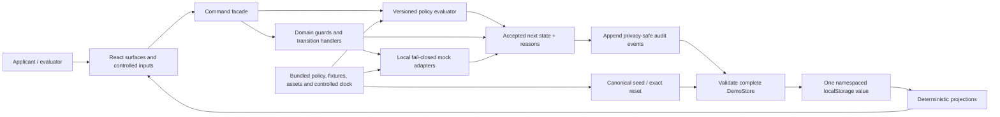

# Technical Architecture and Stack Proposal

## 1. Decision context

> **Status:** `APPROVED — P0 ARCHITECTURE; IMPLEMENTATION NOT STARTED`
>
> This document is the approved Day 1 `H5–H6` P0 architecture-gate output authorized under `D-009` and recorded in accepted decision `D-010`. The approval does not authorize implementation, start or complete Phase 5, or change any tracker status. Phase 2 onward remains formally `NOT STARTED` in [`PLANS.md`](../PLANS.md); specifically, Phase 5 remains `NOT STARTED`. Production-scale architecture remains deferred.

The decision is to choose the smallest technical foundation that can deliver the frozen applicant-first P0 by the end of Day 3 and remain reproducible for Day 4 assurance and deployment. The primary scenario is `SYN-MEDICAL-001`; `SYN-TOURIST-001` is lightweight validation of the same contracts. The architecture must implement the approved domain, lifecycle, recovery and experience contracts without turning a hackathon POC into speculative production infrastructure.

Binding inputs are the approved [`PHASE_1_BRIEF.md`](PHASE_1_BRIEF.md), [`DOMAIN_POLICY_AND_LIFECYCLE_CONTRACT.md`](DOMAIN_POLICY_AND_LIFECYCLE_CONTRACT.md), [`SERVICE_BLUEPRINT_AND_UX_WIREFLOW.md`](SERVICE_BLUEPRINT_AND_UX_WIREFLOW.md), [`SYNTHETIC_DATA_AND_INTEGRATION_BOUNDARIES.md`](SYNTHETIC_DATA_AND_INTEGRATION_BOUNDARIES.md), [`HACKATHON_SPRINT_PLAN.md`](HACKATHON_SPRINT_PLAN.md), accepted decisions `D-001` through `D-009`, and the authoritative [`system dissection`](../docs/evisa-system-dissection.md).

Current official documentation supports the material implementation assumptions used below: Vite builds a static `dist` output and supports TypeScript and CSS Modules while requiring a separate type check; React provides reducer/context primitives; browser `localStorage` is origin-scoped and persists across browser sessions; Next.js static export cannot provide dynamic command route handlers; and Vercel supports production rollback. Sources: [Vite features](https://vite.dev/guide/features), [Vite static deployment](https://vite.dev/guide/static-deploy.html), [React `useReducer`](https://react.dev/reference/react/useReducer), [React `useContext`](https://react.dev/reference/react/useContext), [MDN `localStorage`](https://developer.mozilla.org/en-US/docs/Web/API/Window/localStorage), [Next.js static export](https://nextjs.org/docs/app/guides/static-exports), [Next.js Route Handlers](https://nextjs.org/docs/app/getting-started/route-handlers), and [Vercel rollback](https://vercel.com/docs/deployments/rollback-production-deployment).

## 2. Hard constraints

The proposal must preserve all of the following without qualification:

- Applicant-first product orientation; Medical is primary and Tourist is a lightweight shared-contract check.
- `A00`–`A09` are submission-critical; `R01` and `P01` are supporting thin slices; `A10` is boundary proof and the first surface to reduce if time is threatened.
- All five mandatory recoveries remain executable: interrupted draft, invalid/unclear document, pending/ambiguous payment, re-upload requested, and status/next-action confusion.
- Policy is immutable, versioned data with effective metadata, provenance, manifests and reasons; it is not scattered across UI branches.
- Application, document, payment, scrutiny, notification and ETA lifecycles remain explicit; overall case status is a projection.
- The UI issues guarded commands and cannot mutate authoritative case state, status, audit events or policy pins directly.
- Only bundled project-created synthetic documents and controlled form values exist. There is no file picker, camera, OCR, arbitrary public upload or real-data intake.
- Payment, inspection, notification, APIS, biometric, border and IVFRT/foreigner-record behavior is deterministic, local and fail-closed.
- There is no live government, payment, notification, APIS, biometric, border, IVFRT or model connection; no endpoint or credential is configured.
- There is no external AI dependency and no AI feature, model or provider selection.
- There is no authentication fiction, real applicant identity or production/private-workflow claim.
- Mobile-first accessibility, privacy-safe audit history, exact reset, synthetic ETA labeling, the full deterministic Medical internal-QA rehearsal, a truthful applicant-facing run of at most 60 seconds and a complete submission video of at most 120 seconds remain P0 requirements.
- Deployment must be reproducible from a locked revision with no application secret and no runtime data service.

The optimization target is a four-day hackathon proof of concept, not production scale, multi-user operation, real security accreditation or future integration fidelity.

## 3. Options considered

### Option A — Unified Next.js/React/TypeScript application with local deterministic state

Use Next.js, React and TypeScript as a same-origin modular application; bundle policy and fixtures; keep durable case state in the browser; and expose no database or live service. Styling could use CSS Modules or Tailwind. Ordinary React context/reducer state is sufficient; an additional state-management library does not earn its place.

For persistence, React state alone fails save/resume after reload. `localStorage` is the minimum sufficient durable mechanism; IndexedDB adds asynchronous schema, transaction and migration work intended for larger or binary data, neither of which exists here. The document assets remain bundled URLs and never enter browser storage.

Dynamic same-origin Route Handlers could accept policy or command requests while the browser remains the durable store. That creates two authorities or requires the complete synthetic state to cross the boundary on every command, adding serialization, deployment and two-runtime test work without protecting real data. In a static Next.js export, dynamic `POST` handlers are unavailable; only build-time/static `GET` outputs are supported. Route Handlers are therefore not useful for this P0. If they are omitted, Next.js retains more framework surface than the proposal needs.

### Option B — Vite + React + TypeScript static client application

Use Vite, React and strict TypeScript as a static single-page application. Keep policy evaluation, commands, lifecycle guards, projections, fixture lookup and mock adapters in framework-independent TypeScript modules. Use React Context plus `useReducer` only to expose validated render state and the command facade to components. Persist one small validated synthetic store in `localStorage`; bundle all fixtures and assets; use CSS Modules and global design tokens; and ship no backend, database or serverless handler.

The loss of a unified server boundary is acceptable because the frozen P0 has no shared user state, secret, remote authority, arbitrary file, real integration or trusted server-side operation. A module boundary supplies the architectural separation the demo actually needs. Static hosting makes the absence of runtime external dependencies visible and testable.

### Option C — Full-stack Next.js/TypeScript application with hosted persistence

Use a Next.js runtime plus a hosted database or backend service for case, snapshot, document metadata, payment, scrutiny, ETA and audit state. This would support multi-device and multi-user persistence and create a future server authority.

Those benefits are outside the approved P0. This option adds account/configuration work, database schemas and migrations, remote availability and latency, secrets or service credentials, cleanup/retention duties, deployment coupling and more integration tests. It also creates an unnecessary runtime external dependency for a public demo required to be synthetic-only, resettable and fail-closed. It is technically viable but disproportionate and conflicts with the sprint’s minimum-sufficient objective.

No fourth option is included. A vanilla JavaScript application would reduce framework packages but would make the stateful, accessible multi-surface UI and typed domain contracts slower and less regression-safe under the sprint; it is not genuinely more competitive than Option B.

## 4. Weighted comparison

Raw scores use `1` (poor fit) through `5` (strong fit). Weighted points are `weight × raw score ÷ 5`; totals are out of 100.

| Criterion | Weight | A raw | A points | B raw | B points | C raw | C points |
|---|---:|---:|---:|---:|---:|---:|---:|
| Speed to verified P0 by end of Day 3 | 25 | 4 | 20 | 5 | 25 | 2 | 10 |
| Deterministic policy/lifecycle suitability | 15 | 5 | 15 | 5 | 15 | 5 | 15 |
| Testability and regression safety | 15 | 4 | 12 | 4 | 12 | 4 | 12 |
| Synthetic-data / mock-only isolation | 15 | 4 | 12 | 5 | 15 | 2 | 6 |
| Deployment simplicity and reliability | 10 | 4 | 8 | 5 | 10 | 2 | 4 |
| Save/resume and deterministic reset suitability | 5 | 5 | 5 | 5 | 5 | 5 | 5 |
| Mobile/accessibility implementation fit | 5 | 5 | 5 | 5 | 5 | 5 | 5 |
| Thin reviewer/policy-view support | 5 | 5 | 5 | 5 | 5 | 5 | 5 |
| Maintainability and architectural clarity | 5 | 5 | 5 | 4 | 4 | 4 | 4 |
| **Total** | **100** | | **87** | | **96** | | **66** |

The total favors Option B, but the recommendation rests on the fit of each judgment, not the arithmetic alone.

### Option A score rationale and uncertainty

| Criterion | Raw / points | Rationale | Important uncertainty |
|---|---:|---|---|
| Speed | `4 / 20` | One repository and familiar React primitives are fast, but App Router client/server boundaries and unused framework choices add work. | Team familiarity with current Next.js conventions is unknown. |
| Policy/lifecycles | `5 / 15` | Pure TypeScript domain modules fit cleanly and can be shared across client and handlers. | Discipline is still required to keep rules out of components. |
| Testability | `4 / 12` | Domain tests are simple, but Route Handlers introduce a second execution boundary; omitting them leaves framework-specific rendering behavior to test. | The cost depends on whether the implementation stays static or enables a runtime server. |
| Isolation | `4 / 12` | Local fixtures and mocks satisfy the boundary, but a server runtime has unnecessary outbound-network capability and configuration surface. | Static export removes that concern but also removes useful dynamic handlers. |
| Deployment | `4 / 8` | Next.js is broadly deployable, including static export, but static and server modes have materially different feature contracts. | Choosing the wrong mode could create late deployment rework. |
| Save/resume/reset | `5 / 5` | The same validated `localStorage` envelope and canonical reset work. | Browser storage can be blocked or cleared and is not cross-device. |
| Mobile/accessibility | `5 / 5` | React and semantic HTML impose no obstacle to the approved responsive and keyboard contract. | Quality depends on implementation and manual testing, not the framework. |
| Thin views | `5 / 5` | App routes/layouts can economically support applicant, reviewer and policy views. | Route breadth could tempt scope growth. |
| Maintainability | `5 / 5` | One framework can later introduce a server boundary without changing languages. | That future option has no P0 value and can become premature abstraction. |

### Option B score rationale and uncertainty

| Criterion | Raw / points | Rationale | Important uncertainty |
|---|---:|---|---|
| Speed | `5 / 25` | Vite supplies a small React/TypeScript build with no server/data-service decisions; CSS Modules and native hash routing remove setup dependencies. | Team familiarity is unknown, though the surface area is the smallest evaluated. |
| Policy/lifecycles | `5 / 15` | Pure TypeScript evaluators, commands and projections remain independent of React and deterministic in browser and tests. | Client visibility permits fixture tampering, acceptable only because all state is synthetic and non-authoritative. |
| Testability | `4 / 12` | Vitest shares Vite’s transform pipeline and Playwright can isolate browser storage and test visible behavior. | Browser persistence and focus behavior still require end-to-end tests; unit tests alone are insufficient. |
| Isolation | `5 / 15` | A static build has no application server, database, credential or runtime integration path; all mocks and assets are local. | The static host still delivers assets and its headers must be verified. |
| Deployment | `5 / 10` | One deterministic `dist` directory can be previewed and deployed as immutable static assets. | Stable hosting and rollback still depend on the selected host’s availability. |
| Save/resume/reset | `5 / 5` | One small origin-scoped JSON envelope persists the exact case and can be atomically replaced by canonical fixtures. | Storage can be unavailable in restrictive/private browsing contexts. |
| Mobile/accessibility | `5 / 5` | React plus ordinary HTML/CSS supports the required responsive, focus, label and live-region behavior without custom controls. | Automated scans cannot replace keyboard and screen-reader-informed review. |
| Thin views | `5 / 5` | A handful of hash-addressed shells can render all logical surfaces from the same projection and store. | Hash routing needs deliberate heading focus and browser-navigation tests. |
| Maintainability | `4 / 4` | Clear module boundaries and one runtime are easy to understand; framework-independent domain code remains portable. | A future shared/server authority would require a new persistence/command adapter and approved architecture change. |

### Option C score rationale and uncertainty

| Criterion | Raw / points | Rationale | Important uncertainty |
|---|---:|---|---|
| Speed | `2 / 10` | Schema, migrations, service setup, credentials, cleanup and remote integration consume critical-path time. | Existing team templates could reduce setup, but none is established in this repository. |
| Policy/lifecycles | `5 / 15` | Server-side TypeScript and relational persistence can represent the approved contracts well. | A database does not itself prevent ad-hoc state or policy duplication. |
| Testability | `4 / 12` | Server tests and durable state are possible, but integration fixtures, migrations and service lifecycle increase test setup. | Hosted-service emulators and CI support are not selected or proven. |
| Isolation | `2 / 6` | The service can store only synthetic data, but it creates a networked runtime, credential and external failure boundary that the P0 does not need. | Provider network controls vary and would require separate verification. |
| Deployment | `2 / 4` | Frontend, server runtime and database must remain compatible and reachable. | Free-tier quotas, regional behavior and provider incidents are outside project control. |
| Save/resume/reset | `5 / 5` | Hosted persistence and transactional reset can satisfy the contract. | Exact cleanup and seed permissions add operational work. |
| Mobile/accessibility | `5 / 5` | The frontend can use the same React accessibility approach. | Backend complexity does not improve this score. |
| Thin views | `5 / 5` | Shared server data naturally supports multiple views. | The P0 does not need real multi-user coordination or roles. |
| Maintainability | `4 / 4` | A server authority is a conventional long-term structure. | It is overbuilt now and introduces provider-specific maintenance before requirements exist. |

## 5. Recommended architecture

**Accepted P0 architecture — Option B at `96/100`: a static Vite + React + strict TypeScript modular monolith using CSS Modules, one validated `localStorage` store, pure deterministic domain commands/projections, bundled policy and fixtures, and local mock adapters.** Explicit user approval records this P0 architecture only. Implementation has not begun and remains separately gated.

Use Node.js `24.x` LTS and npm for the development toolchain, then pin exact approved versions and commit the generated lockfile during the separately authorized foundation task. Node’s official release page lists Node 24 as LTS as of this proposal: [Node.js releases](https://nodejs.org/en/about/previous-releases).

| Layer | Minimum responsibility | Boundary rule |
|---|---|---|
| Static frontend/runtime | Render the shell and accessible surfaces; capture only controlled choices; issue commands. | No server runtime, serverless function, service worker, analytics or remote fetch. |
| React application layer | Context exposes state, projections and one `execute(command)` facade; reducer holds validated render state. | Components never write aggregate state, policy pins or audit events. |
| Domain layer | Entities, discriminated state unions, command types, guards, idempotency and accepted/rejected command results. | Pure TypeScript with no React, storage or network imports. |
| Policy layer | Validate bundles; select one active/pinned version; evaluate typed facts; return manifests, reasons and provenance. | Immutable versioned data; no category-specific UI authority. |
| State-transition/command layer | Run aggregate and cross-aggregate guards, call local adapters when declared, emit events and produce the next store. | Sole mutation path; failure returns no success event or state change. |
| Projection/read-model layer | Derive case status, exactly one next action/wait, timeline and surface view models. | Read-only and rebuildable; never persisted as authoritative status. |
| Mock adapter layer | Return declared local outcomes for payment, inspection, notification and downstream simulations. | No URL, credential, SDK, discovery or fallback path. |
| Fixture layer | Hold canonical scenarios, expected results, controlled clock, asset metadata, hashes and seed states. | Bundled synthetic data only; reset replaces derived state exactly. |
| Audit/event layer | Append the approved privacy-safe event envelope for accepted transitions. | No bodies, images, declarations, credentials, biometrics or arbitrary user values. |
| Persistence layer | Parse, load and save one versioned synthetic store and run exact reset. | `localStorage` only; corrupt/unsupported data fails closed to an explicit reset choice. |

React state/context/reducer is sufficient because this is one small client aggregate. Redux, Zustand, XState or another state-management dependency is not recommended. The domain command layer—not the reducer or a component—enforces lifecycle authority.

## 6. Application and data-flow diagram



Command execution order is fixed: validate the command and current store; resolve the pinned policy; evaluate aggregate and cross-aggregate guards; obtain only a declared local adapter outcome; create the next state and audit events; validate the entire result; persist the single store value; then update React render state and projections. A rejection leaves the stored state unchanged and returns a safe reason.

## 7. Persistence decision

Use one namespaced value, for example `india-evisa-reimagined:p0:v1`, containing a versioned `DemoStore` JSON document. `localStorage` is selected because the state is small text metadata, must survive reload/browser restart for the same origin, and must reset in one replacement operation. React state alone cannot meet resume. `sessionStorage` does not survive a closed tab. IndexedDB is unnecessary because there are no arbitrary files, large objects, queries or multi-store transactions. An external database is unnecessary because there is no cross-device, multi-user, authenticated or shared authoritative case.

| Required state | Minimum stored shape |
|---|---|
| Synthetic case | One `Case` with scenario, deterministic IDs, revision and immutable policy pin. |
| Draft snapshots | Ordered bounded snapshots with sequence, answers, step, saved synthetic time and policy pin. |
| Application | Explicit application aggregate state and idempotent command-result records. |
| Document versions | Metadata, bundled asset ID/hash, sequence, inspection and lifecycle state; never file bytes. |
| Payment | One or more contract-permitted mock attempts, synthetic reference, state and reconciliation record. |
| Scrutiny | Explicit record, supported reason, reviewer action and submitted-version references. |
| Notification | Local simulated delivery state and retry count. |
| ETA | Guarded state and bundled/generated synthetic artifact reference; never a valid credential. |
| Downstream events | Named local simulation events and opaque synthetic references only. |
| Audit events | Append-only privacy-safe event envelopes in deterministic order. |
| Policy pin | Qualified immutable bundle ID/version plus digest on the case and snapshots. |
| Reset metadata | Store schema version, canonical manifest digest and controlled fixture clock. |

The persistence adapter validates data on every load and before every save. Unknown schema versions, digest mismatch, parse failure, unsupported IDs or cross-lifecycle inconsistency produce `STATUS_UNAVAILABLE`/storage-unavailable behavior and offer an explicit canonical reset; they never get repaired silently. Reset removes only the application’s exact namespaced key, loads the selected canonical seed, verifies its manifest digest and projections, and is idempotent. It must not call `localStorage.clear()` because that could erase unrelated origin data.

Browser storage is not secure or tamper-proof and is not presented as production authority. That limitation is acceptable only because the application accepts and contains synthetic data exclusively.

## 8. Policy architecture

Store policy as validated JSON data under versioned bundle directories, with TypeScript schemas and pure evaluators outside React.

| Policy concern | Proposed shape |
|---|---|
| Active bundle | `SYN-EVISA-POLICY/1.0.0/bundle.json`, status `ACTIVE_FOR_DEMO`, fictional effective bounds, provenance, digest and member references. |
| Preview bundle | `SYN-EVISA-POLICY/1.1.0-preview/bundle.json`, status `DRAFT`; it can be evaluated only in `PREVIEW` mode. |
| Question manifests | Ordered typed question IDs, value kinds, options, requiredness and shared/Medical/Tourist membership. |
| Document manifests | Requirement IDs, supported bundled asset classes, inspection profile and reason references. |
| Reason catalogue | Stable reason code, applicant copy, non-claim copy and provenance references. |
| Evaluation facts | Only the bounded facts permitted by the domain contract; no name, passport body, document body, payment fact or real health detail. |
| Evaluation algorithm | Validate bundle → select active or pinned version → sort matching rules by priority then `ruleId` → merge compatible effects → fail closed on missing facts, no support or conflicts. |

Zod validates policy, persisted state and fixture manifests at runtime because TypeScript types disappear after compilation and browser storage can be modified. The evaluator returns the exact four `scenarioSupport` values, qualified bundle/version, controlled time, selected manifests, synthetic fee result, reasons and provenance. It never returns a legal eligibility result. UI components render the returned manifests and reasons; they contain no authoritative `if medical` or `if tourist` branches.

Bundle JSON is immutable once active. A change creates another directory/version. The preview bundle never becomes active through the UI and never repins a case. Node’s built-in `crypto` is sufficient for fixture/bundle verification scripts; no hashing dependency is required.

## 9. Lifecycle and state architecture

Represent every aggregate state as a TypeScript discriminated union and every command as a typed object containing `type`, `caseId`, actor, controlled timestamp, payload and idempotency key where required. Implement one framework-independent command facade over aggregate-specific transition handlers:

```text
executeCommand(currentStore, command, dependencies)
  -> Accepted { nextStore, emittedEvents, result }
  | Rejected { currentStore, reasonCode, allowedAction }
```

- Application, document, payment, scrutiny, notification and ETA handlers each own their transition table and local guards.
- One orchestration layer enforces cross-aggregate guards such as scrutiny prerequisites, correlated re-upload transitions and ETA dual issuance guards.
- Idempotency results are recorded by `(caseId, commandType, key, payloadDigest)`; the same key/payload returns the prior result, while changed payload fails with `IDEMPOTENCY_CONFLICT`.
- An accepted command emits the named audit event in the same next-store value. A rejected command emits no success event and causes no state change.
- The status projector validates consistency and applies the approved precedence table to derive one case status and one next action/wait.
- React receives only accepted, validated stores through the command facade. Form-local editing values may exist transiently, but become authoritative only through a guarded save command.

This avoids five unrelated ad-hoc React machines while preserving separate lifecycles. A state-machine package is not proposed: the frozen transitions are explicit, small and already specified, and pure tables/functions are faster to implement and test.

## 10. Mock adapter architecture

Each adapter is an injected local TypeScript interface with one implementation backed by the canonical scenario manifest. No interface contains a base URL, credential, retry-to-live setting or provider SDK. Missing scenario data returns `MOCK_UNAVAILABLE` and no lifecycle advance.

| Adapter | Minimum operations and allowed data | Deterministic outputs / fail-closed behavior |
|---|---|---|
| Payment | Start and reconcile using synthetic case/attempt IDs, demo credits, scenario and idempotency key. | Confirmed, pending, ambiguous, reconciled or declared failure; one attempt exactly once; unknown fixture rejects. |
| Document inspection | Inspect a bundled asset ID/hash against a named document class/profile. | Pass or exact controlled defect; never reads arbitrary bytes, performs OCR or calls a scanner. |
| Notification | Queue/deliver/retry a local template to a reserved-recipient reference. | Delivered simulated or declared failure/retry; output stays in the local store, never SMTP/API. |
| APIS | Evaluate a synthetic itinerary/ETA/passport reference and named scenario. | Named matched/delayed/unavailable event only; no carrier or APIS endpoint. |
| Biometric reference | Accept an opaque synthetic reference and scenario outcome only. | Simulated availability/quality/match label; rejects image, fingerprint, template, embedding or device data. |
| Border outcome | Consume only mock APIS, biometric and ETA facts plus fictional port/event IDs. | Named admitted/denied/referred/unavailable demonstration outcome; no real admissibility effect. |
| IVFRT/foreigner record | Append a permitted synthetic entry/exit event to a local ledger. | Recorded/duplicate/conflict/unavailable; no private identifier, schema, protocol or endpoint. |

Synthetic scrutiny and ETA completion are internal declared domain simulations rather than external adapters. All adapter outcomes are driven by fixture IDs and the controlled clock, not randomness or wall time.

## 11. Routing and surface consolidation

Use native hash-addressed application shells so static hosting needs no rewrite rule or routing dependency. Navigation uses real links, supports Back/Forward, and moves focus to the new page heading. The domain projection, not the URL, decides which actions are valid.

| Economical route/shell | Logical surfaces | Implementation treatment |
|---|---|---|
| `#/` | `A00`, `A01` | Entry, persistent notice, scenario choice and bounded purpose guidance on one progressive screen. |
| `#/apply` | `A02`–`A05` | One applicant shell with the six-step progress model; create/resume, adaptive form, document cards and review are conditional sections driven by state/manifests. |
| `#/status` | `A06`–`A09` | Payment, projected status/timeline, correction and ETA are one state-led workspace exposing exactly one action or wait. |
| `#/status/downstream` | `A10` | Minimal post-ETA boundary strip; link appears only after the synthetic ETA and is cut first if schedule requires. |
| `#/reviewer` | `R01` | One conceptual view over the same store with one supported re-upload command; no role/auth fiction. |
| `#/policy` | `P01` | Read-only active/candidate comparison and non-mutating preview. |
| `#/demo` plus global reset control | `D01` | Seven canonical seed shortcuts with confirmation, manifest verification and navigation to the relevant shell. |

No logical ID requires a separate page component. Applicant components receive priority; reviewer/policy components reuse read models and cards. Tourist uses the same routes, renderer, commands and lifecycle handlers with a different selected manifest.

## 12. Testing strategy

Use one Vite-native unit/component runner and one browser runner. Do not add a separate contract-test framework, component-preview system or visual-regression service for P0.

| Concern | Minimum tool and coverage | Proposed command |
|---|---|---|
| Unit/domain | Vitest: entities, command acceptance/rejection, idempotency, audit emission and projection precedence. | `npm run test:unit` |
| Policy | Vitest table tests for Medical, Tourist, missing facts, conflicts, effective selection, pin/resume and preview non-mutation. | `npm run test:policy` |
| Lifecycle transitions | Vitest implements the approved 20-test catalogue, including invalid transition and ETA guards. | `npm run test:lifecycle` |
| Persistence/reset/fixtures | Vitest with a browser-storage test environment: corrupt load, save/reload, exact reset, manifest digest and no unrelated-key deletion. | `npm run test:fixtures` |
| Components/integration | React Testing Library + `user-event` in jsdom: manifest rendering, labels, errors, one-action rule, watermark and no arbitrary-input controls. | `npm run test:components` |
| Applicant end to end | Playwright Chromium project: reset-to-ETA Medical path and lightweight Tourist reuse through visible controls. | `npm run test:e2e` |
| Five recoveries | Five tagged Playwright scenarios, each from its canonical D01 seed and repeated per the approved acceptance counts. | `npm run test:recoveries` |
| Accessibility/mobile | Playwright role/label assertions, `@axe-core/playwright` serious/critical scan, `360×800` overflow assertion and manual keyboard/focus/reduced-motion checklist. | `npm run test:a11y` |
| Safety/boundaries | Node scripts using built-ins plus Playwright request observation: forbidden domains/APIs, secrets/PII patterns, watermarks, no file input, no remote request and privacy-safe logs. | `npm run verify:boundaries` |
| Lint | ESLint with TypeScript and React Hooks rules. | `npm run lint` |
| Type checking | Strict TypeScript, separate because Vite transpiles but does not type-check. | `npm run typecheck` |
| Production build | Vite build followed by static-output scan and local preview smoke. | `npm run build` and `npm run smoke` |

`npm run check` should run lint, type checking, all Vitest suites and production build. `npm run verify` should add Playwright E2E/recoveries/accessibility and boundary verification. Playwright’s official guidance supports isolated browser storage and user-visible locators; its accessibility guide also warns that axe scans require manual assessment alongside them: [Playwright best practices](https://playwright.dev/docs/best-practices) and [accessibility testing](https://playwright.dev/docs/accessibility-testing). Vitest is selected because it shares Vite’s transform/configuration pipeline: [Vitest rationale](https://vitest.dev/guide/why.html).

## 13. Security and privacy enforcement

| Boundary | Architectural enforcement |
|---|---|
| Synthetic-only input | UI exposes controlled choices and locked fixture summaries only; runtime schemas allow known synthetic IDs/options and reject unexpected values. |
| No arbitrary upload persistence | No `<input type="file">`, drop zone, camera API, File API or arbitrary asset repository exists; document commands accept only manifest asset IDs. |
| No secrets/live endpoints | No `.env` requirement, server runtime, integration SDK, base URL or credential field; scans fail on prohibited patterns. |
| Fail-closed mocks | Injected local adapters return a declared fixture result or `MOCK_UNAVAILABLE`; there is no fallback implementation. |
| Runtime network denial | Production headers propose CSP `connect-src 'none'`; no analytics, remote font/media or service worker is included. `connect-src` blocks script-initiated fetch/XHR/WebSocket/EventSource/beacon connections: [MDN CSP `connect-src`](https://developer.mozilla.org/en-US/docs/Web/HTTP/Reference/Headers/Content-Security-Policy/connect-src). |
| Privacy-safe logging | Audit events are the approved metadata envelope; console/body logging and remote analytics are prohibited and tested. |
| Deterministic reset | Reset replaces only the exact namespaced store with a validated canonical seed and verifies the manifest digest/projection. |
| No payment credentials | Payment UI offers named mock outcomes and synthetic demo credits only; adapters reject credential-like fields. |
| No biometric material | The biometric interface accepts namespaced references/outcomes only and has no capture/file/media API. |
| Persistent unofficial labeling | A global shell notice appears on every route; submission, mock views, document previews and ETA repeat approved labels/watermarks. |
| No path to government systems | Static client contains no live-domain strings or request code; CSP, source/build scans and request-observation tests provide independent gates. |
| No fake authentication | Applicant/reviewer/policy switches are labeled demo perspectives, not roles or access controls. |

The recommendation requires **zero changes** to accepted data, integration, product, policy, lifecycle, accessibility or non-claim boundaries. `localStorage` contains cleartext synthetic metadata, so it must never be generalized to real applicant data without a new approved production architecture.

## 14. Dependency proposal

### Core stack

| Tool | Role | P0 status |
|---|---|---|
| Node.js `24.x` LTS + npm | Reproducible development/build runtime and lockfile installation. | Required after approval; exact patch pinned at foundation. |
| Vite | Development server and static production build. | Recommended framework tool. |
| React + React DOM | Accessible component rendering and state/context primitives. | Recommended UI framework. |
| TypeScript, strict mode | Compile-time domain, command, policy and projection contracts. | Required. |
| CSS Modules + global CSS custom properties | Scoped styling, tokens, responsive behavior and print rules using Vite built-ins. | Required; no styling package. |

### Proposed direct non-framework dependencies

| Dependency | Problem solved | Why built-in/framework behavior is insufficient | P0 status |
|---|---|---|---|
| `zod` | Runtime validation of JSON policy, fixtures and mutable browser storage with inferred TypeScript types. | TypeScript types are erased at runtime; handwritten validators for the rich contract are slower and easier to drift. Zod has no external runtime dependencies: [Zod](https://zod.dev/). | Required. |
| `vitest` | Fast unit, policy, lifecycle, persistence and component test execution using Vite transforms. | Vite has no test runner; Node’s runner would need separate JSX/browser-environment setup. | Required dev dependency. |
| `jsdom` | DOM environment for fast component tests. | Node and Vitest do not provide browser DOM APIs by default. | Required dev dependency. |
| `@testing-library/react` | Render/query components by user-visible semantics. | React DOM provides rendering, not test queries or cleanup utilities. | Required dev dependency. |
| `@testing-library/user-event` | Realistic keyboard, focus and form interactions in component tests. | Direct event dispatch misses important user interaction sequences. | Required dev dependency. |
| `@playwright/test` | Real-browser Medical/Tourist/recovery, mobile and deployed smoke tests with isolated storage. | Unit/jsdom tests cannot verify browser persistence, navigation, layout, CSP or production build behavior. | Required dev dependency. |
| `@axe-core/playwright` | Automated detection of common serious/critical accessibility issues in actual screens/states. | Browser and Playwright do not include a WCAG rules engine; manual checks remain required too. | Required dev dependency. |
| `eslint` | Static code-quality and unsafe-pattern checks. | TypeScript does not enforce React hooks, dead patterns or project lint rules. | Required dev dependency. |
| `typescript-eslint` | TypeScript parsing and recommended lint rules. | ESLint core does not understand TypeScript semantics fully. | Required dev dependency. |
| `eslint-plugin-react-hooks` | React hook correctness. | React reports some runtime problems but does not provide a standalone source gate. | Required dev dependency. |

No router, state manager, Tailwind, form library, date library, UUID library, HTTP client, database SDK, authentication SDK, upload/OCR/media SDK, analytics SDK, AI SDK/model package or external mock server is proposed. Native hash navigation, React primitives, CSS Modules, `crypto`, `URL`, `JSON` and `localStorage` are sufficient. Exact package versions must be pinned in `package-lock.json` only after the stack is explicitly approved.

## 15. Deployment proposal

After implementation and a separately authorized deployment task, build the static Vite `dist` directory and deploy it to one Vercel project with a stable production URL.

- The deployed artifact contains only immutable HTML, CSS, JavaScript and bundled synthetic assets; there is no function, database or runtime secret.
- Each verified revision receives an immutable deployment; only the approved revision is promoted to the stable production alias.
- Vercel supports redirecting production to the previous known deployment without rebuilding, providing a simple rollback path.
- Production headers should set a restrictive CSP including `connect-src 'none'`, `form-action 'none'`, `object-src 'none'`, `frame-ancestors 'none'` and same-origin-only scripts/styles/assets. The exact header is verified against Vite output before deployment.
- External analytics, fonts, images, APIs and preview widgets remain disabled. The only network activity is initial same-origin delivery of the static app and assets.
- Reset remains a browser-local D01 operation; deployed smoke tests always begin with canonical reset and validate the store manifest.
- A deterministic captured walkthrough remains the fallback if the host is unavailable.

The hosting platform is a delivery dependency, not an application runtime dependency. No deployment is authorized or performed by this proposal.

## 16. Proposed repository tree

This tree is illustrative and must not be created until explicit implementation approval:

```text
.
├── index.html
├── package.json
├── package-lock.json
├── tsconfig.json
├── vite.config.ts
├── eslint.config.js
├── playwright.config.ts
├── vercel.json
├── public/
│   └── synthetic-assets/
│       ├── documents/
│       ├── portraits/
│       └── eta/
├── scripts/
│   ├── verify-boundaries.mts
│   ├── verify-fixtures.mts
│   └── verify-watermarks.mts
├── src/
│   ├── app/
│   │   ├── App.tsx
│   │   ├── DemoStoreProvider.tsx
│   │   └── routes/
│   │       ├── entry.tsx
│   │       ├── apply.tsx
│   │       ├── status.tsx
│   │       ├── reviewer.tsx
│   │       ├── policy.tsx
│   │       └── demo.tsx
│   ├── components/
│   │   ├── shell/
│   │   ├── forms/
│   │   ├── documents/
│   │   ├── timeline/
│   │   └── notices/
│   ├── domain/
│   │   ├── entities.ts
│   │   ├── states.ts
│   │   ├── commands.ts
│   │   ├── transitions/
│   │   └── execute-command.ts
│   ├── policy/
│   │   ├── schemas.ts
│   │   ├── evaluate.ts
│   │   ├── reasons.json
│   │   └── bundles/
│   │       ├── 1.0.0/
│   │       └── 1.1.0-preview/
│   ├── fixtures/
│   │   ├── manifest.json
│   │   ├── medical.json
│   │   ├── tourist.json
│   │   └── recovery-seeds.json
│   ├── mocks/
│   │   ├── contracts.ts
│   │   └── local-adapters/
│   ├── persistence/
│   │   ├── schema.ts
│   │   ├── local-storage-repository.ts
│   │   └── reset.ts
│   ├── projections/
│   │   ├── case-status.ts
│   │   ├── next-action.ts
│   │   └── timeline.ts
│   ├── audit/
│   │   └── events.ts
│   └── styles/
│       ├── tokens.css
│       └── global.css
└── tests/
    ├── unit/
    ├── policy/
    ├── lifecycle/
    ├── persistence/
    ├── components/
    └── e2e/
        ├── medical.spec.ts
        ├── tourist.spec.ts
        ├── recoveries.spec.ts
        └── accessibility.spec.ts
```

## 17. Day 1 H6–H8 implementation order

These are proposed next tasks after approval; none is executed here.

| Order | Small implementation step | Independent verification gate |
|---:|---|---|
| 1 | Framework/project foundation: initialize Vite React TypeScript with Node 24 LTS/npm, CSS Modules and the minimal folder shell. | Clean install from lockfile; development and production build start; no product behavior or external configuration yet. |
| 2 | Quality commands: add strict type checking, ESLint, Vitest, Playwright/axe configuration and `check`/`verify` scripts. | A trivial unit, component and browser smoke test passes; lint, type check and build pass. |
| 3 | Domain/policy skeleton: encode types, bundle/fixture schemas, one Medical evaluation and guarded draft creation as pure modules. | Medical policy contract and invalid-transition unit tests pass; UI has no policy branch. |
| 4 | Local persistence/reset: implement validated one-key repository, controlled clock, canonical seed/reset and corrupt-store failure. | Mutate-save-reload-reset comparison returns the exact manifest; unrelated keys remain untouched. |
| 5 | Local mock boundaries: define all seven interfaces and fail-closed local fixture implementations with no URL/credential fields. | Adapter contract/failure tests and source network scan pass. |
| 6 | Medical/Tourist fixture manifest: add canonical IDs, policy pin, asset metadata/hashes, expected outcomes and recovery seeds. | Fixture validation, synthetic conventions and deterministic hashes pass for both scenarios. |
| 7 | First policy-to-state vertical smoke path: `A00` scenario choice → `A01` policy result → `A02` guarded draft creation/save → projection. | Visible version/reason/save evidence; reload resumes the same case; Playwright smoke, lint, type check, unit tests and build pass. |

Every step stops at its verification gate. Application breadth, payment, scrutiny, ETA and further surfaces begin only in their later approved blocks.

## 18. Risks and mitigations

| Risk | Consequence | Mitigation |
|---|---|---|
| Browser storage is blocked, cleared or corrupt | Resume/reset evidence could fail. | Detect availability at boot, validate before use, fail closed with an explicit reset/unavailable explanation, and test the supported browser/deployed origin. Do not silently claim a save. |
| Multi-tab writes conflict | Event or aggregate history could diverge. | Treat the demo as single-tab; store a monotonic revision, detect storage events/revision mismatch and require reload/reset rather than merge. |
| Client state or policy can be inspected/tampered with | A user can alter a synthetic result locally. | Validate every load/command, label it non-authoritative, keep no real data or backend effect, and fail closed on digest/invariant mismatch. |
| Static-client design later needs shared authority | Future migration work is required. | Keep domain, command, adapter and persistence interfaces framework-independent; make server persistence a later approved adapter/architecture change. |
| Hash routing harms navigation/focus if implemented casually | Accessibility and demo flow regress. | Use real links, a small route table, heading-focus management, Back/Forward tests and Playwright role-based assertions. |
| Local mock timing becomes nondeterministic | Rehearsals and tests become flaky. | Use controlled fixture time and explicit named outcomes; no randomness, wall clock or background network retry. |
| Package or framework churn | Reproducibility or build may break. | Pin direct/transitive versions with `package-lock.json`, use `npm ci`, record Node 24 LTS, keep dependencies minimal and deploy a known revision. |
| Static host or production alias fails | Public demo is unavailable. | Verify the promoted deployment, retain the prior known-good rollback and prepare the required deterministic capture. |
| CSS/accessibility work is underestimated | `M11` or the 60-second run fails. | Build mobile/semantic shell first, reuse primitives, run keyboard/overflow/axe checks continuously and cut A10/institutional visual depth before applicant quality. |
| Proposal is treated as production architecture | Safety or credibility claim expands. | Keep proposal/P0 labels, document deferred concerns and require a new authorized discovery and decision before real data or integrations. |

## 19. Deferred production concerns

The recommendation intentionally does not solve:

- Real identity, applicant accounts, authentication, authorization, consent or case access.
- Shared, cross-device or multi-user persistence; relational/object storage; encryption and key management.
- Arbitrary document upload, malware scanning, safe rendering, OCR, identity or biometric processing.
- Real payment protocols, callbacks, settlement, reconciliation, refunds or financial compliance.
- Real notification delivery, queues, transactional outbox or retry operations.
- Real scrutiny roles, queues, routing, risk systems, adjudication, maker-checker or privileged audit.
- Real APIS, border, biometric, IVFRT or government integration protocols.
- Production policy authoring, approval, signing, publication, migration, rollback or legal validation.
- High availability, scaling, SLOs, monitoring, alerting, backup, retention, deletion or disaster recovery.
- Formal threat modeling, penetration testing, accreditation, privacy/legal compliance or government authorization.
- Full category, nationality, language, locale, device or assistive-technology coverage.
- SSR, SEO, analytics and performance infrastructure not needed for the evaluator-accessible static demo.
- Any AI feature, model, provider, SDK or remote inference boundary.

These are not hidden weaknesses or implied capabilities. They are explicit production-phase subjects requiring authorized discovery and new accepted decisions.

## 20. Approval record

The user explicitly approved **Option B — Vite + React + strict TypeScript, CSS Modules, validated `localStorage`, pure domain/policy/command/projection modules, bundled fixtures, local fail-closed adapters, the stated test toolchain, and static Vercel deployment** as the hackathon P0 architecture.

The approval carries these limits and safeguards:

- accepted decision `D-010` satisfies only the Day 1 `H5–H6` architecture-choice gate;
- implementation has not begun and is not authorized by this architecture approval;
- production-scale architecture remains deferred, and no Phase 5 completion is claimed;
- `localStorage` is acceptable only because all P0 state is disposable synthetic data;
- UI code must never mutate lifecycle or application state directly; every authoritative write must pass through the validated domain-command layer;
- loaded persisted state must pass schema and version validation before use; invalid or incompatible data fails closed to a safe canonical reset and is never silently trusted; and
- no package, framework, source tree, configuration or application code has been created, and Day 1 `H6–H8` implementation has not begun.
